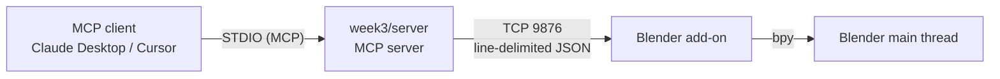

# Assignments for CS146S: The Modern Software Developer

This is the home of the assignments for [CS146S: The Modern Software Developer](https://themodernsoftware.dev), taught at Stanford University fall 2025.

Eight weeks of assignments, each in its own folder, progressing from raw prompt
engineering to production-grade agentic tooling. Later weeks build on a shared
FastAPI + SQLite application, and the repo doubles as a place to practise the
workflow of driving an AI coding agent: spec it, test it, review it, ship it.

## Table of contents

- [Repo Setup](#repo-setup)
- [Repository Structure](#repository-structure)
- [Assignment Status](#assignment-status)
- [Week-by-Week Summary](#week-by-week-summary)
- [Running the Projects](#running-the-projects)
- [Testing](#testing)
- [Tooling](#tooling)

## Repo Setup
These steps work with Python 3.12.

1. Install Anaconda
   - Download and install: [Anaconda Individual Edition](https://www.anaconda.com/download)
   - Open a new terminal so `conda` is on your `PATH`.

2. Create and activate a Conda environment (Python 3.12)
   ```bash
   conda create -n cs146s python=3.12 -y
   conda activate cs146s
   ```

3. Install Poetry
   ```bash
   curl -sSL https://install.python-poetry.org | python -
   ```

4. Install project dependencies with Poetry (inside the activated Conda env)
   From the repository root:
   ```bash
   poetry install --no-interaction
   ```

5. Install [Ollama](https://ollama.com/download) if you intend to run the
   LLM-backed features in week 1 or week 2.
   ```bash
   ollama pull mistral-nemo:12b
   ollama serve
   ```

## Repository Structure

```
modern-software-dev-assignments/
├── pyproject.toml            # Shared dependencies (Poetry)
├── week1/                    # Prompting techniques
│   ├── k_shot_prompting.py
│   ├── chain_of_thought.py
│   ├── tool_calling.py
│   ├── self_consistency_prompting.py
│   ├── rag.py
│   ├── reflexion.py
│   └── data/api_docs.txt
├── week2/                    # Action item extractor (FastAPI + SQLite)
│   ├── app/                  #   Routers, services, data layer, schemas
│   ├── frontend/index.html   #   Single-page UI
│   ├── tests/                #   53 tests
│   └── README.md
├── week3/                    # Blender MCP server
│   ├── server/               #   MCP server (STDIO)
│   ├── blender_addon/        #   Blender add-on (TCP bridge)
│   ├── tests/                #   156 tests
│   └── README.md
├── week4/  … week7/          # Starter app + automation / tooling tasks
└── week8/                    # Multi-stack web app (demo day)
```

## Assignment Status

| Week | Topic | Artifact | Status |
|:----:|-------|----------|--------|
| 1 | Prompting Techniques | 6 standalone scripts | **Prompts pending** — 8 `TODO`s remain |
| 2 | Action Item Extractor | FastAPI + SQLite app | **Implemented** — 53 tests passing |
| 3 | Build a Custom MCP Server | Blender MCP server + add-on | **Implemented** — 156 tests passing |
| 4 | The Autonomous Coding Agent IRL | Starter app + automations | Starter app only |
| 5 | Agentic Development with Warp | Starter app + automations | Starter app only |
| 6 | Scan and Fix Vulnerabilities | Semgrep scan and fixes | Starter app only |
| 7 | AI Code Review with Graphite | Review workflow | Starter app only |
| 8 | Multi-Stack AI-Accelerated Web App | Three app versions | Not started |

Write-ups (`writeup.md`) are still to be filled in for weeks 2 and 4–8.

## Week-by-Week Summary

### Week 1 — Prompting Techniques

Six self-contained scripts, each demonstrating one core LLM prompting technique
against a local Ollama model. The task in each file is to supply the prompt
(the only thing you are meant to change), then iterate until the built-in check
passes.

| File | Technique |
|------|-----------|
| `k_shot_prompting.py` | K-shot (few-shot) prompting |
| `chain_of_thought.py` | Chain-of-thought reasoning |
| `tool_calling.py` | Tool / function calling |
| `self_consistency_prompting.py` | Self-consistency sampling |
| `rag.py` | Retrieval-augmented generation |
| `reflexion.py` | Reflexion (self-critique and retry) |

References in `week1/data/` and `week1/note/`. **Status: prompts still pending.**

### Week 2 — Action Item Extractor

A web app that turns free-form notes into an enumerated checklist of action items.

- **Two interchangeable extractors.** A deterministic regex heuristic, and an
  LLM-backed one that calls Ollama with a JSON-schema-constrained response.
- **Typed API contract.** Every endpoint declares Pydantic request/response
  models, giving automatic 422 validation and a live OpenAPI schema at `/docs`.
- **Clean data layer.** Explicitly-closed SQLite connections, foreign keys
  actually enabled, and mutations that report whether a row was affected.
- **Centralised error handling.** Service and data layers raise domain
  exceptions that one handler maps to HTTP responses (404 / 422 / 503).
- **Lifecycle and config.** Startup work lives in a FastAPI `lifespan` handler
  rather than module import, and all settings come from environment variables.

Seven REST endpoints (`/notes`, `/action-items`) back a single-page frontend with
**Extract**, **Extract LLM**, and **List Notes** buttons.

See [`week2/README.md`](./week2/README.md) for the full API reference.

### Week 3 — Blender MCP Server

A [Model Context Protocol](https://modelcontextprotocol.io) server that lets an AI
assistant drive a **running Blender session** — inspect the scene, create and
transform objects, apply materials, render, and capture viewport screenshots.

`bpy` only exists inside Blender, so the project is split in two halves that talk
over a local TCP socket:



**Eight tools:** `get_scene_info`, `get_object_info`, `create_object`,
`transform_object`, `delete_object`, `set_material`, `render_scene`,
`get_viewport_screenshot`.

Two problems drove the design:

- **Blender's API is not thread-safe.** Socket connections arrive on worker
  threads, so commands are marshalled onto Blender's main thread via
  `bpy.app.timers`, with the worker blocked on the result.
- **STDIO servers must never write to stdout.** stdout *is* the MCP protocol
  channel, so all logging goes to stderr.

Resilience covers connection retries with exponential backoff, separate connect
and command timeouts, throttling so Blender stays responsive, and typed errors
whose text tells the model exactly how to recover.

See [`week3/README.md`](./week3/README.md) for setup, client configuration, and
the tool reference.

### Weeks 4–8 — Agentic Tooling and Capstone

These share a FastAPI + SQLite starter application and focus on the surrounding
practice rather than new app code.

| Week | Focus |
|------|-------|
| 4 | Build automations on top of an autonomous coding agent (Claude Code) |
| 5 | Same, using Warp as the agentic development environment |
| 6 | Scan the codebase for vulnerabilities with Semgrep and fix them |
| 7 | Run an AI-assisted code review workflow with Graphite |
| 8 | Build one web app three times on different stacks, using AI app generators |

**Status: starter code only.**

## Running the Projects

Always activate the environment first, and run from the repository root.

### Week 1 — prompting scripts

```bash
conda activate cs146s
python week1/k_shot_prompting.py
```

Requires a local Ollama server (`ollama serve`).

### Week 2 — action item extractor

```bash
poetry run uvicorn week2.app.main:app --reload
```

Then open <http://127.0.0.1:8000/>. The heuristic extractor works with no
model; the **Extract LLM** button additionally needs Ollama running.

### Week 3 — Blender MCP server

Install `week3/blender_addon/blender_mcp_addon.py` via
**Blender → Edit → Preferences → Add-ons → Install from Disk**, enable it, then
click **Start MCP Bridge** in the 3D viewport sidebar (`N` → Blender MCP tab).

```bash
poetry run python -m week3.server
```

The MCP client launches this for you — see
[`week3/README.md`](./week3/README.md) for the Claude Desktop configuration.

## Testing

Most weeks ship tests. Pass the week path explicitly.

```bash
poetry run pytest week2 -v      # 53 tests
poetry run pytest week3 -v      # 156 tests
poetry run pytest week3 -v -k llm
```

| Suite | Tests | Notes |
|-------|:-----:|-------|
| `week2` | 53 | FastAPI endpoints, extraction, frontend markup. Offline — the LLM is stubbed |
| `week3` | 156 | Bridge protocol, all 8 MCP tools, add-on commands, and real STDIO end-to-end. Offline — no Blender needed |

> **Always scope the path.** A bare `pytest` at the repo root also collects
> `week4`–`week7`, whose starter tests are not runnable yet and will abort
> collection with import errors.

## Tooling

| Tool | Purpose | Command |
|------|---------|---------|
| Black | Formatting (line length 100) | `poetry run black .` |
| Ruff | Linting (`E`, `F`, `I`, `UP`, `B`) | `poetry run ruff check week2 week3` |
| pytest | Testing | `poetry run pytest week2 week3` |
| pre-commit | Git hooks (weeks 4–7) | `pre-commit install` |
