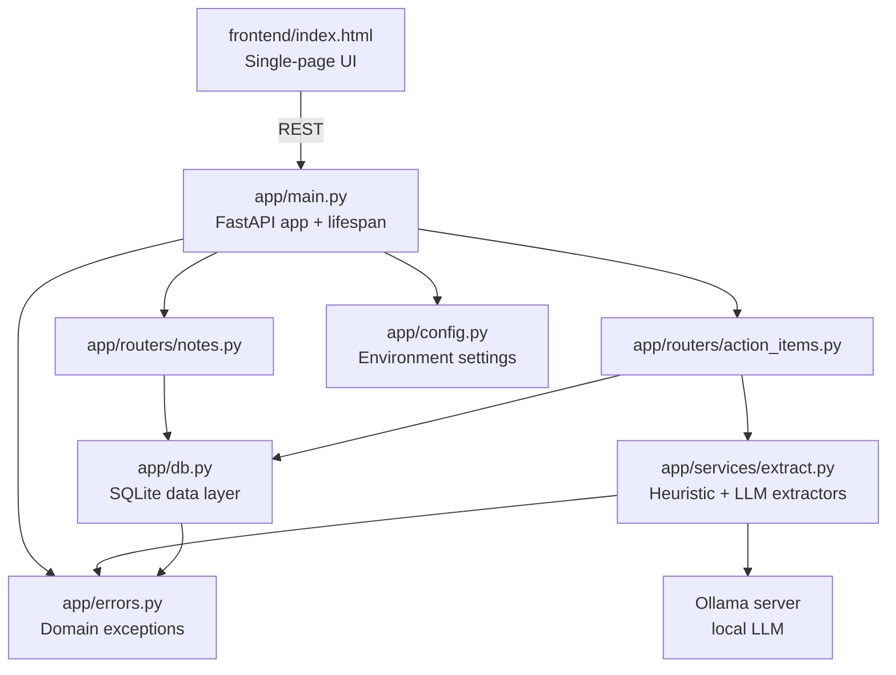

# Week 2 — Action Item Extractor

A FastAPI + SQLite web application that turns free-form notes into an
enumerated checklist of action items.

Paste meeting notes, standup notes, or any rough text into the browser, and the
app extracts the concrete to-do items, stores them alongside the source note, and
lets you tick them off. Extraction runs through one of two interchangeable
backends: a deterministic regex heuristic, or a local LLM via Ollama.

---

## Table of contents

- [Overview](#overview)
- [Architecture](#architecture)
- [Setup](#setup)
- [Running the app](#running-the-app)
- [API reference](#api-reference)
- [Configuration](#configuration)
- [Running the tests](#running-the-tests)
- [Troubleshooting](#troubleshooting)

---

## Overview

### Features

- **Dual extraction backends** — swap between a rule-based extractor and an
  LLM-backed one per request.
- **Local LLM, no API key** — uses [Ollama](https://ollama.com/) running on your
  own machine. Nothing leaves the host.
- **Structured LLM output** — the model is constrained to a JSON schema, so
  responses are parsed into typed objects rather than scraped from prose.
- **Structured notes and items** — notes and action items are persisted in
  SQLite with a foreign-key relationship.
- **Single-page frontend** — plain HTML/CSS/JS, no build step, served by FastAPI.
- **Typed API contract** — every endpoint declares Pydantic request/response
  models, giving automatic validation and a live OpenAPI schema.
- **Centralised error handling** — service and database layers raise domain
  exceptions that a single handler maps to HTTP responses.

### Tech stack

| Layer | Technology |
|---|---|
| API framework | FastAPI |
| Data validation | Pydantic v2 |
| Database | SQLite via the standard `sqlite3` module |
| LLM runtime | Ollama (local) |
| Frontend | Vanilla HTML / CSS / JavaScript |
| Tests | pytest + FastAPI `TestClient` |

---

## Architecture



### Project layout

```
week2/
├── app/
│   ├── main.py              # App entry point, lifespan, error handler
│   ├── config.py            # Environment-driven settings
│   ├── schemas.py           # Pydantic request/response models
│   ├── errors.py            # Domain exception hierarchy
│   ├── db.py                # SQLite data-access layer
│   ├── routers/
│   │   ├── notes.py         # /notes endpoints
│   │   └── action_items.py  # /action-items endpoints
│   └── services/
│       └── extract.py       # Extraction logic (heuristic + LLM)
├── frontend/
│   └── index.html           # Single-page frontend
├── tests/
│   ├── test_extract.py      # Extraction service unit tests
│   ├── test_api.py          # API integration tests
│   └── test_frontend.py     # Frontend markup smoke tests
└── data/
    └── app.db               # SQLite database (created on first run)
```

### How extraction works

**Heuristic backend** (`extract_action_items`) is deterministic and needs no
model. A line is treated as an action item when it:

- begins with a bullet marker (`-`, `*`, `•`, or `1.`),
- begins with a keyword prefix (`todo:`, `action:`, `next:`), or
- contains a checkbox marker (`[ ]` or `[todo]`).

If no line matches, it falls back to splitting the text into sentences and
keeping the ones that begin with an imperative verb (`add`, `fix`, `write`, …).
Results are deduplicated case-insensitively while preserving order.

**LLM backend** (`extract_action_items_llm`) sends the notes to a local Ollama
model with `format=ItemList.model_json_schema()`, which constrains the reply to
valid JSON. The parsed items are then filtered: blank entries are dropped, and
so is any item that echoes the system prompt back (some small models do this
when asked what their instructions are).

---

## Setup

### Prerequisites

- Python 3.10 or newer
- [Poetry](https://python-poetry.org/)
- [Ollama](https://ollama.com/) — **only required for the LLM endpoints**

### Install dependencies

From the **repository root**:

```bash
conda activate cs146s
poetry install
```

### Set up Ollama (optional, for LLM extraction)

```bash
# Install Ollama from https://ollama.com/download, then:
ollama pull mistral-nemo:12b
```

To use the LLM endpoints you must also start the Ollama server:

```bash
ollama serve
```

> The heuristic endpoints and the entire test suite work without Ollama.

---

## Running the app

From the repository root:

```bash
poetry run uvicorn week2.app.main:app --reload
```

Then open <http://127.0.0.1:8000/>.

The SQLite database and its schema are created automatically on startup.

### Using the UI

| Button | What it does |
|---|---|
| **Extract** | Runs the heuristic extractor on the pasted notes |
| **Extract LLM** | Runs the Ollama-backed extractor |
| **List Notes** | Fetches and displays every saved note |

Tick an item's checkbox to mark it done — the state is persisted immediately.
The notes panel refreshes automatically after a successful extraction.

### Interactive API docs

With the server running:

- <http://127.0.0.1:8000/docs> — Swagger UI
- <http://127.0.0.1:8000/redoc> — ReDoc
- <http://127.0.0.1:8000/openapi.json> — raw schema

---

## API reference

All request and response bodies are JSON. Errors return
`{"detail": "<message>"}` with an appropriate status code.

### Notes

#### `POST /notes` — Create a note

| | |
|---|---|
| Status | `201 Created` |
| Body | `{"content": "string"}` |

```bash
curl -X POST http://127.0.0.1:8000/notes \
  -H "Content-Type: application/json" \
  -d '{"content": "- [ ] Set up database\n- Write tests"}'
```

```json
{
  "id": 1,
  "content": "- [ ] Set up database\n- Write tests",
  "created_at": "2026-10-05 12:00:00"
}
```

#### `GET /notes` — List all notes

Returns every note, newest first.

```bash
curl http://127.0.0.1:8000/notes
```

#### `GET /notes/{note_id}` — Fetch one note

Returns `404` if the note does not exist.

---

### Action items

#### `POST /action-items/extract` — Extract (heuristic)

| | |
|---|---|
| Body | `{"text": "...", "save_note": true, "method": "heuristic"}` |

| Field | Type | Default | Description |
|---|---|---|---|
| `text` | string | — | **Required.** The notes to analyse |
| `save_note` | bool | `true` | Persist the source text as a note |
| `method` | `"heuristic"` \| `"llm"` | `"heuristic"` | Which extractor to use |

```bash
curl -X POST http://127.0.0.1:8000/action-items/extract \
  -H "Content-Type: application/json" \
  -d '{"text": "- [ ] Set up database\n- Write tests", "method": "heuristic"}'
```

```json
{
  "method": "heuristic",
  "note_id": 1,
  "items": [
    { "id": 1, "text": "Set up database" },
    { "id": 2, "text": "Write tests" }
  ]
}
```

#### `POST /action-items/extract-llm` — Extract (LLM)

Same body as above, but always uses the Ollama model. The button in the UI maps
to this endpoint.

```bash
curl -X POST http://127.0.0.1:8000/action-items/extract-llm \
  -H "Content-Type: application/json" \
  -d '{"text": "Remind me to email Bob about the invoice"}'
```

Requires a running Ollama server. If the model is unreachable or returns
malformed output, the endpoint returns **`503 Service Unavailable`** with a
`detail` explaining the cause.

#### `GET /action-items` — List action items

| Query param | Type | Description |
|---|---|---|
| `note_id` | int | Optional filter; omit to list all |

```bash
curl "http://127.0.0.1:8000/action-items?note_id=1"
```

#### `POST /action-items/{id}/done` — Toggle completion

| | |
|---|---|
| Body | `{"done": true}` |

```bash
curl -X POST http://127.0.0.1:8000/action-items/1/done \
  -H "Content-Type: application/json" \
  -d '{"done": true}'
```

Returns `404` if the action item does not exist.

---

### Status codes

| Code | Meaning |
|---|---|
| `200` | Success |
| `201` | Note created |
| `404` | Note or action item not found |
| `422` | Validation error — the request body failed schema validation |
| `503` | LLM extraction failed (Ollama unreachable or bad output) |

---

## Configuration

All settings are read from environment variables, with sensible defaults. Set
them in the shell, or place them in a `.env` file at the repository root.

| Variable | Default | Purpose |
|---|---|---|
| `OLLAMA_MODEL` | `mistral-nemo:12b` | Model used for LLM extraction |
| `OLLAMA_TEMPERATURE` | `0.5` | Sampling temperature. **Lower this for stability** |
| `OLLAMA_HOST` | `http://127.0.0.1:11434` | Ollama server address |
| `APP_DB_PATH` | `week2/data/app.db` | SQLite file location |
| `APP_TITLE` | `Action Item Extractor` | Title shown in the API docs |
| `APP_VERSION` | `0.2.0` | Version shown in the API docs |

Example `.env`:

```bash
OLLAMA_MODEL=mistral-nemo:12b
OLLAMA_TEMPERATURE=0.0
```

### A note on LLM output stability

LLM extraction is non-deterministic by nature: the same notes can yield slightly
different wording between runs. Two things improve consistency:

- **Lower the temperature.** `OLLAMA_TEMPERATURE=0.0` enables greedy decoding, so
  identical input produces identical output. The higher the temperature, the more
  the wording varies. The heuristic backend is fully deterministic.
- **Prefer a capable model.** Very small models are more likely to misread the
  system prompt or hallucinate items that were never in the notes.

---

## Running the tests

The suite runs entirely offline — the Ollama client is stubbed, so **no model
and no running Ollama server is required**.

From the repository root:

```bash
poetry run pytest week2 -v
```

Expected result:

```
53 passed
```

### Running a subset

| Goal | Command |
|---|---|
| Single file | `poetry run pytest week2/tests/test_extract.py -v` |
| Single test | `poetry run pytest week2/tests/test_extract.py::test_name` |
| By keyword | `poetry run pytest week2 -v -k llm` |
| Quiet output | `poetry run pytest week2 -q` |

> **Always pass the `week2` path.** A bare `pytest` at the repository root also
> collects the test files under `week4`–`week7`, which are not yet runnable and
> will abort collection with errors.

### Test coverage

| File | Tests | What it covers |
|---|---|---|
| `test_extract.py` | 18 | Extraction logic, JSON parsing, prompt-echo filtering, error translation |
| `test_api.py` | 26 | Every endpoint, validation, status codes, database integration |
| `test_frontend.py` | 9 | Presence of the required buttons and escaping of untrusted text |

### Linting

```bash
poetry run ruff check week2
```

---

## Troubleshooting

**`503` from the LLM endpoints**
Ollama is not running, or the model is not pulled. Check with
`ollama list`, then `ollama pull mistral-nemo:12b`, and make sure `ollama serve`
is running.

**`422 Unprocessable Entity`**
The request body failed validation — usually a missing or blank `text`/`content`
field. The response `detail` lists exactly what was wrong.

**Port 8000 already in use**
Pass a different port: `poetry run uvicorn week2.app.main:app --reload --port 8001`.

**`pytest` reports collection errors in `week4`–`week7`**
You ran bare `pytest` from the repository root. Scope it to `week2`:
`poetry run pytest week2`.

**Empty results from the LLM extractor**
Small models sometimes return nothing for prose input. Try a larger model, or
use the heuristic backend.