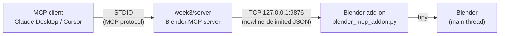
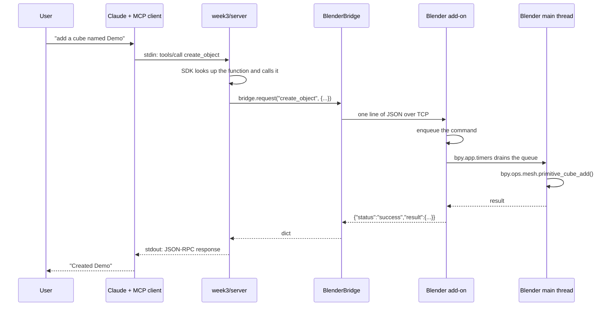

# Week 3 — Blender MCP Server

A [Model Context Protocol](https://modelcontextprotocol.io) server that lets an AI
assistant drive a **running Blender session**: inspect the scene, create and
transform objects, apply materials, render, and take viewport screenshots.

Ask Claude "make a red cube on top of a grey plane, then show me" and it will
call the tools in this repo to actually do it in your open Blender window.

---

## Table of contents

- [How it works](#how-it-works)
- [Prerequisites](#prerequisites)
- [Setup](#setup)
- [Running](#running)
- [Configuring the MCP client](#configuring-the-mcp-client)
- [Example invocation flow](#example-invocation-flow)
- [Tool reference](#tool-reference)
- [Bridge protocol](#bridge-protocol)
- [Configuration](#configuration)
- [Design notes](#design-notes)
- [Under the hood: how the MCP layer works](#under-the-hood-how-the-mcp-layer-works)
- [Development](#development)
- [Troubleshooting](#troubleshooting)

---

## How it works

`bpy` — Blender's Python API — only exists inside a running Blender process, so an
MCP server cannot import it. Instead the project is split in two halves that talk
over a local TCP socket:



| Component | Runs in | Responsibility |
|---|---|---|
| `week3/server/` | Your Python environment | Speaks MCP over STDIO, validates arguments, translates errors |
| `week3/blender_addon/blender_mcp_addon.py` | Inside Blender | Owns the TCP socket, runs `bpy` commands on Blender's main thread |

**Why a bridge instead of headless rendering?** Driving the live application means
scripted edits land in the same session a human is looking at, so you can watch
the model work, undo it interactively, and take real viewport screenshots. A
headless `bpy` process cannot do any of that.

---

## Prerequisites

| Requirement | Notes |
|---|---|
| Python 3.10+ | The MCP server runs here |
| [Poetry](https://python-poetry.org/) | Dependency management |
| [Blender](https://www.blender.org/download/) 3.6+ | Required for real use; the test suite does not need it |

---

## Setup

### 1. Install Python dependencies

From the **repository root**:

```bash
conda activate cs146s
poetry install
```

### 2. Install the Blender add-on

1. Open Blender.
2. Go to **Edit → Preferences → Add-ons**.
3. Click **Install from Disk…** (top-right dropdown).
4. Select `week3/blender_addon/blender_mcp_addon.py`.
5. Enable the checkbox next to **"Blender MCP Bridge"**.

### 3. Start the bridge inside Blender

1. In the 3D viewport, press `N` to open the sidebar.
2. Click the **Blender MCP** tab.
3. Click **Start MCP Bridge**. The panel should show `Status: Running`.

The host and port are configurable under **Edit → Preferences → Add-ons → Blender
MCP Bridge → Preferences**.

---

## Running

### Verify the bridge is up

```bash
poetry run python -c "
from week3.server.bridge import BlenderBridge
print(BlenderBridge().ping())
"
```

A `success` payload with `pong: True` means Blender is reachable.

### Run the MCP server

```bash
poetry run python -m week3.server
```

It speaks MCP over STDIO and waits for a client. You do not normally run this by
hand — the MCP client launches it (see below). To inspect it interactively, use the
[MCP Inspector](https://github.com/modelcontextprotocol/inspector):

```bash
npx @modelcontextprotocol/inspector poetry run python -m week3.server
```

---

## Configuring the MCP client

### Claude Desktop

Edit `claude_desktop_config.json`:

- **macOS**: `~/Library/Application Support/Claude/claude_desktop_config.json`
- **Windows**: `%APPDATA%\Claude\claude_desktop_config.json`

```json
{
  "mcpServers": {
    "blender": {
      "command": "poetry",
      "args": ["run", "python", "-m", "week3.server"],
      "cwd": "/absolute/path/to/modern-software-dev-assignments",
      "env": {
        "BLENDER_MCP_HOST": "127.0.0.1",
        "BLENDER_MCP_PORT": "9876"
      }
    }
  }
}
```

Replace `cwd` with the absolute path to this repository. Restart Claude Desktop
after saving. A hammer icon in the input box indicates the tools loaded.

### Cursor

Add the same block under `mcpServers` in `.cursor/mcp.json` (project) or
`~/.cursor/mcp.json` (global).

### Using a virtualenv directly

If Poetry is not on the client's `PATH`, point at the interpreter instead:

```json
{
  "mcpServers": {
    "blender": {
      "command": "/absolute/path/to/.venv/bin/python",
      "args": ["-m", "week3.server"],
      "cwd": "/absolute/path/to/modern-software-dev-assignments"
    }
  }
}
```

---

## Example invocation flow

With Blender open, the bridge running, and the client restarted:

**You type:**

> Look at my current Blender scene and tell me what's in it.

**The model calls** `get_scene_info` **and replies:**

> Your scene contains 3 objects: a Cube at (0, 0, 0), a Camera at (7.36, -6.93, 4.96),
> and a Light at (4.08, 1.01, 5.90).

**You type:**

> Add a red metallic sphere named Hero above the cube, then show me a screenshot.

**The model calls, in order:**

1. `create_object(object_type="sphere", name="Hero", size=2, location=[0, 0, 3])`
2. `set_material(name="Hero", base_color=[1.0, 0.0, 0.0], metallic=0.9, roughness=0.2)`
3. `get_viewport_screenshot()`

**A screenshot appears in the chat**, showing the red sphere above the cube.

**You type:**

> The sphere should be bigger. Make it twice the size and re-render at 1920x1080.

**The model calls** `transform_object(name="Hero", scale=[2, 2, 2])` then
`render_scene(resolution_x=1920, resolution_y=1080)` and reports the output path.

---

## Tool reference

Eight tools are exposed.

### Inspection

#### `get_scene_info()`

Returns the scene name, blend file path, current frame, active object, and a list
of every object with its name, type, and location.

> Call this first to learn what exists before creating or editing anything.

**Input:** none.

**Output:**
```json
{
  "scene": "Scene",
  "blender_version": "4.2.0",
  "filepath": "/home/me/demo.blend",
  "frame_current": 1,
  "object_count": 2,
  "objects": [
    {"name": "Cube", "type": "MESH", "location": [0.0, 0.0, 0.0]},
    {"name": "Camera", "type": "CAMERA", "location": [7.36, -6.93, 4.96]}
  ],
  "active_object": "Cube"
}
```

#### `get_object_info(name)`

Detailed information about one object.

| Parameter | Type | Required | Description |
|---|---|---|---|
| `name` | string | yes | Exact object name from the Outliner |

**Output:** type, location, `rotation_euler_degrees`, scale, dimensions, visibility,
parent, materials, modifiers, and for meshes `vertex_count` and `polygon_count`.

**Errors:** `object_not_found` with the list of available names in the hint.

---

### Editing

#### `create_object(object_type, name=None, size=2.0, location=None, light_type=None)`

| Parameter | Type | Default | Description |
|---|---|---|---|
| `object_type` | string | — | `cube`, `sphere`, `cylinder`, `plane`, `cone`, `torus`, `camera`, `light` |
| `name` | string | auto | Name for the new object |
| `size` | float | `2.0` | Blender units. Edge length for cubes/planes; diameter for spheres/cylinders/cones/tori |
| `location` | `[x, y, z]` | origin | World position |
| `light_type` | string | `POINT` | Only for `light`: `POINT`, `SUN`, `SPOT`, `AREA` |

**Errors:** `unsupported_object_type`, `unsupported_light_type`, `invalid_params`
(non-positive size, wrong-length location).

#### `transform_object(name, location=None, rotation=None, scale=None)`

Provide at least one of the three; omitted values are left untouched.

| Parameter | Type | Unit |
|---|---|---|
| `name` | string | — |
| `location` | `[x, y, z]` | Blender units |
| `rotation` | `[x, y, z]` | **degrees** |
| `scale` | `[x, y, z]` | multipliers, must be positive |

**Errors:** `invalid_params` (no fields given, wrong length, non-positive scale),
`object_not_found`.

#### `delete_object(name)`

Permanently removes an object. Cannot be undone from the MCP side, so the model is
instructed to confirm the name first.

**Errors:** `object_not_found`.

#### `set_material(name, base_color=None, metallic=0.0, roughness=0.5, material_name=None)`

Creates or updates a Principled BSDF material and assigns it to a **mesh** object.

| Parameter | Type | Range | Description |
|---|---|---|---|
| `base_color` | `[r, g, b]` | each 0.0–1.0 | `(1, 0, 0)` is red |
| `metallic` | float | 0.0–1.0 | 0 = matte, 1 = metal |
| `roughness` | float | 0.0–1.0 | 0 = mirror, 1 = fully diffuse |
| `material_name` | string | — | Reusing a name updates that material everywhere |

**Errors:** `invalid_params` (out-of-range values), `unsupported_object_type`
(non-mesh target).

---

### Output

#### `render_scene(filepath=None, resolution_x=None, resolution_y=None)`

Renders to an image file. **Slow** — seconds to minutes, and Blender's window is
unresponsive while it runs.

**Output:** `filepath`, `size_bytes`, `resolution`, `engine`. Does not return pixels.

**Errors:** `no_camera` (with a hint suggesting `create_object`),
`unsupported_engine`.

#### `get_viewport_screenshot(max_size=800)`

Captures the viewport and returns a **PNG image** the client shows to the model.
Far more reliable than reasoning about coordinates.

**Requires** Blender running with a visible 3D viewport; unavailable in background
mode.

**Errors:** `viewport_unavailable`.

---

## Bridge protocol

The add-on speaks one JSON object per line, one request per TCP connection.

**Request:**
```json
{"type": "create_object", "params": {"object_type": "cube", "size": 3}}
```

**Success:**
```json
{"status": "success", "result": {"name": "Cube", "object_type": "MESH", "location": [0,0,0]}}
```

**Error:**
```json
{
  "status": "error",
  "error": {
    "code": "object_not_found",
    "message": "No object named 'ghost' exists in this blend file.",
    "hint": "Available objects: ['Cube', 'Camera']"
  }
}
```

The dispatcher never raises: every failure becomes a structured error response, so
one bad request cannot take the bridge down.

---

## Configuration

All settings are environment variables, read by `week3/server/config.py`.

| Variable | Default | Purpose |
|---|---|---|
| `BLENDER_MCP_HOST` | `127.0.0.1` | Bridge host |
| `BLENDER_MCP_PORT` | `9876` | Bridge port; must match the add-on preference |
| `BLENDER_MCP_CONNECT_TIMEOUT` | `5.0` | Seconds to wait for a connection |
| `BLENDER_MCP_TIMEOUT` | `120.0` | Seconds to wait for a command; raise it for heavy renders |
| `BLENDER_MCP_MAX_RETRIES` | `3` | Connection attempts before giving up |
| `BLENDER_MCP_BACKOFF_BASE` | `0.5` | First retry delay, doubling each attempt |
| `BLENDER_MCP_BACKOFF_CAP` | `8.0` | Maximum retry delay |
| `BLENDER_MCP_MIN_INTERVAL` | `0.05` | Minimum gap between commands |

### Resilience behaviour

| Situation | Behaviour |
|---|---|
| Blender closed / add-on disabled | Retried with exponential backoff, then a `BlenderUnavailableError` naming the fix |
| Blender busy or showing a dialog | `BlenderTimeoutError` after `BLENDER_MCP_TIMEOUT`; **not** retried, since Blender already received the command |
| Blender rejects a command | `BlenderCommandError` with the code, message, and hint; **not** retried, to avoid duplicating side effects |
| Malformed response | `BlenderProtocolError` with a preview of the bytes |
| Empty result | For `get_scene_info` an empty scene is a valid success, not an error. For a missing object, `object_not_found` with the available names |
| Rapid successive calls | Throttled by `BLENDER_MCP_MIN_INTERVAL` so Blender's main thread stays responsive |

---

## Design notes

### Blender's API is not thread-safe

`bpy` may only be called from Blender's main thread, but socket connections arrive
on worker threads. `MainThreadExecutor` bridges the two: each command is pushed
onto a queue, `bpy.app.timers` runs it on the main thread, and the worker blocks on
a `threading.Event` until the result is ready. Without this, Blender crashes or
silently corrupts state.

### STDIO servers must never write to stdout

stdout **is** the MCP protocol channel. A stray `print` corrupts the stream and the
client drops the connection. All logging in `week3/server` goes to stderr, and
`test_server_integration.py` would fail immediately if that were violated.

### Errors are written for a language model to read

Error text states what went wrong *and* what to do. `BlenderUnavailableError` names
the exact menu path to start the bridge, because the model relaying "Blender isn't
reachable" to a user is far less useful than "open View3D → Sidebar → Blender MCP →
Start MCP Bridge".

---

## Under the hood: how the MCP layer works

How the pieces fit together, from the protocol on the wire down to how a command
reaches `bpy`.

### MCP is a protocol, not a framework

MCP standardises one thing: how an AI application (the **client**) discovers and
calls tools offered by another program (the **server**).

| Role | Who | What it cares about |
|---|---|---|
| Client | Claude Desktop, Cursor | Calling tools; not how they are implemented |
| Server | `week3/server` | What it can do; not who is calling |

The value is not "being able to call tools" — that was always possible. It is that
you write the server once and any MCP client can use it.

### The wire protocol

Three exchanges cover everything: negotiate capabilities, list tools, call a tool.
JSON-RPC over STDIO, one message per line. These are real captured messages.

**1. Client opens the session.**

```json
{"jsonrpc":"2.0","id":1,"method":"initialize",
 "params":{"protocolVersion":"2025-06-18","capabilities":{},
           "clientInfo":{"name":"demo","version":"1.0"}}}
```

**2. Server answers with its capabilities and its instructions.**

```json
{"jsonrpc":"2.0","id":1,"result":{
  "protocolVersion":"2025-06-18",
  "capabilities":{"tools":{"listChanged":false}},
  "serverInfo":{"name":"blender-mcp","version":"1.0.0"},
  "instructions":"Controls a running Blender session ..."}}
```

The `instructions` field is the `INSTRUCTIONS` constant in `main.py`, delivered
verbatim to the model.

**3. Client asks what is available.**

```json
{"jsonrpc":"2.0","id":2,"method":"tools/list"}
```

```json
{"jsonrpc":"2.0","id":2,"result":{"tools":[{
  "name":"create_object",
  "description":"Add a new object to the scene and return its name and position...",
  "inputSchema":{"type":"object","properties":{
      "object_type":{"type":"string"},
      "location":{"items":{"type":"number"},"type":"array"}},
    "required":["object_type"]}}]}}
```

**4. Client calls a tool.**

```json
{"jsonrpc":"2.0","id":3,"method":"tools/call",
 "params":{"name":"create_object",
           "arguments":{"object_type":"cube","name":"Demo"}}}
```

```json
{"jsonrpc":"2.0","id":3,"result":{
  "content":[{"type":"text","text":"{\n  \"name\": \"Demo\", ...}"}],
  "isError":false}}
```

### How a Python function becomes a tool

`@server.tool()` translates Python concepts into protocol concepts:

| Python | Protocol | Who reads it |
|---|---|---|
| Function name | `name` | The model, to choose a tool |
| **Docstring** | `description` | **The model, to decide whether to call it** |
| Type hints and `Args:` | `inputSchema` | The client, to validate arguments |

```python
def register_tools(server: MCPServer, bridge: BlenderBridge) -> None:
    """Attach every Blender tool to ``server``."""

    @server.tool()
    def get_scene_info() -> dict[str, Any]:
        """Inspect the currently open Blender scene.

        Returns the scene name, the blend file path, the current frame, and a
        list of every object with its name, type, and world-space location.
        Use this first to learn what exists before creating or editing anything.
        """
        try:
            return bridge.request("get_scene_info")
        except Exception as exc:  # noqa: BLE001 - reported as a tool error
            raise _fail(exc) from exc
```

**The docstring is not a comment.** A comment is for colleagues and can be deleted
without consequence. This docstring is the specification the model reads when
deciding what to do — it is serialised into the `tools/list` response. Delete it and
the tool becomes effectively invisible: the model sees a name but no reason to use
it.

That is why these docstrings state ranges, units, and defaults in full sentences.
`Must be greater than 0.` and `rotation is in degrees` are not padding; they are how
ambiguity gets removed before the model has a chance to guess wrong.

### The full call chain



### What you write, and what the SDK writes for you

This split is the single most useful thing to understand before reading the code,
because it tells you where the interesting parts are.

| Concern | Who handles it |
|---|---|
| JSON-RPC framing, ids, and correlation | The SDK |
| The `initialize` handshake and capability negotiation | The SDK |
| Dispatch from a tool name to a Python function | The SDK |
| Building `inputSchema` from type hints | The SDK |
| Wrapping results into `content` blocks | The SDK |
| Converting a raised exception into `isError: true` | The SDK |
| **Deciding what the tools should be, and describing them** | **You** |
| **Validating business rules beyond types** (colour ranges, units) | **You** |
| **Crossing the process boundary to Blender** | **You** |
| **Getting onto Blender's main thread** | **You** |
| **Turning low-level failures into actionable messages** | **You** |

There is no hand-written `if name == "create_object"` dispatch anywhere in this
repository — the decorator registers the function and the SDK looks it up. The work
this project actually implements is everything after `bridge.request(...)`.

### Why a socket bridge, not a direct import

`bpy` is not a pip package. It is the Python interpreter Blender embeds, and it only
exists inside a running Blender process. Importing it from the MCP server process is
impossible, so the two must talk across a process boundary.

Opening a socket to a **running** Blender (rather than spawning a headless `bpy`
instance) also means scripted edits land in the session the user is looking at, which
is what makes viewport screenshots meaningful.

### Getting onto Blender's main thread

Socket connections are handled on **worker threads**, but `bpy` may only be called
from Blender's **main thread**. Calling it from a worker thread crashes Blender or,
worse, silently corrupts scene data.

`MainThreadExecutor` moves the work across:

```python
    def submit(self, func, timeout: float | None = DEFAULT_COMMAND_TIMEOUT):
        self.ensure_started()
        task = _Task(func)
        self._queue.put(task)                    # (1) hand the work over
        if not task.done.wait(timeout):          # (2) worker blocks here
            raise CommandError(
                "timeout",
                f"Blender did not finish the command within {timeout:g}s.",
                "Blender may be busy or waiting on a modal dialog. "
                "Dismiss any open dialog and retry.",
            )
        if task.error is not None:
            raise task.error
        return task.result                       # (5) woken up with the result

    def _drain(self) -> float:
        """Execute every queued task. Returning a float reschedules the timer."""
        while True:
            try:
                task = self._queue.get_nowait()
            except queue.Empty:
                break
            if task.done.is_set():
                continue
            try:
                task.result = task.func()        # (3) real bpy calls, on the main thread
            except BaseException as exc:  # noqa: BLE001 - relayed to the caller
                task.error = exc
            finally:
                task.done.set()                  # (4) wake the worker
        return self._interval
```

1. The worker pushes a `_Task` onto the queue.
2. It then **blocks** on `task.done.wait()`.
3. `bpy.app.timers`, registered against `_drain` in `ensure_started()`, calls it on
   the main thread every `0.02s`, and the queued function runs there.
4. `task.done.set()` wakes the blocked worker.
5. The worker returns the result — or re-raises the exception, which crossed the
   thread boundary inside `task.error`.

Note the trailing `return self._interval` in `_drain`: a Blender timer callback that
returns a float is rescheduled for that many seconds later. Returning `None` would
stop it permanently.

The upshot is that a socket worker can call `bpy` "directly" while the actual call
always happens on Blender's main thread.

### How failures become `isError`

A tool that fails is a **successful response** carrying a flag, not a protocol error.
Here is a real captured exchange for an object that does not exist:

```json
{"jsonrpc":"2.0","id":4,"result":{
  "content":[{"type":"text",
    "text":"Error executing tool get_object_info: Blender rejected the command
            (object_not_found): No object named 'ghost' exists in this blend file.
            Hint: Available objects: ['Demo']"}],
  "isError":true}}
```

Three things to notice:

- **The `id` matches and there is no `error` field.** A protocol-level error means
  the conversation itself is broken and should be torn down; "that object does not
  exist" is a business failure the model can recover from by itself.
- **The SDK prefixes the message** with `Error executing tool get_object_info: `.
  Our `ToolError` text is nested inside it.
- **The hint carries the fix.** `Hint: Available objects: ['Demo']` lets the model
  correct itself — it now knows a valid name. Compare that with a bare
  `Object not found`, which the model can only relay to the user as a dead end.

`_fail()` is where domain exceptions become tool errors:

```python
def _fail(exc: Exception) -> ToolError:
    """Translate a domain exception into a message a model can act on."""
    if isinstance(exc, BlenderMCPError):
        return ToolError(str(exc))
    logger.exception("Unexpected tool failure")
    return ToolError(f"Unexpected error: {type(exc).__name__}: {exc}")
```

Domain errors keep their type all the way until this one function. That is why
`bridge.py` can raise `BlenderUnavailableError`, `BlenderTimeoutError`, and
`BlenderCommandError` separately even though they all end up as a `ToolError` — the
message each one carries is the part the model acts on.

### Docstrings pass through verbatim

Because the docstring is serialised straight into `tools/list`, its whitespace goes
with it. The captured description for `get_scene_info` actually reads:

```
"Inspect the currently open Blender scene.\n\n        Returns the scene name, ...\n        "
```

The `\n        ` runs are the indentation from the source file, and there is trailing
whitespace at the end. It is cosmetic rather than harmful, but it does mean the model
reads ragged text. Dedenting the docstrings (or normalising them with
`inspect.cleandoc`) would tidy it up.

---
